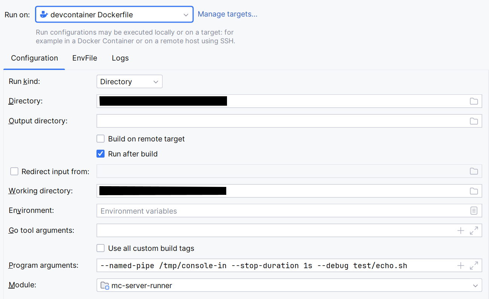
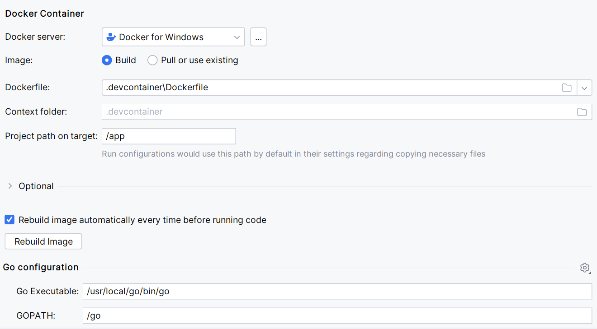

[](https://github.com/itzg/mc-server-runner/releases/latest)
[](https://github.com/itzg/mc-server-runner/actions/workflows/test.yml)


This is a process wrapper used by 
[the itzg/minecraft-server Docker image](https://hub.docker.com/r/itzg/minecraft-server/)
to ensure the Minecraft server is stopped gracefully when the container is sent the `TERM` signal.

## Usage

> Available at any time using `-h`

```
  -bootstrap string
        Specifies a file with commands to initially send to the server
  -debug
        Enable debug logging
  -detach-stdin
        Don't forward stdin and allow process to be put in background
  -shell string
        When set, pass the arguments to this shell
  -stop-duration duration
        Amount of time in Golang duration to wait after sending the 'stop' command.
  -stop-server-announce-delay duration
        Amount of time in Golang duration to wait after announcing server shutdown
```

The `-stop-server-announce-delay` can by bypassed by sending a `SIGUSR1` signal to the `mc-server-runner` process.  
This works in cases where a prior `SIGTERM` has already been sent **and** in cases where no prior signal has been sent.

## Development Testing

Start a golang container for building and execution. The port is only needed for remote console functionality:

```bash
docker run -it --rm \
  -v ${PWD}:/build \
  -w /build \
  -p 2222:2222 \
  golang:1.19
```

Within that container, build/test by running:

```bash
go run . test/dump.sh
go run . test/bash-only.sh
# Used to test remote console functionality
# Connect to this using an ssh client from outside the container to ensure two-way communication works
go run . -remote-console /usr/bin/sh
# The following should fail
go run . --shell sh test/bash-only.sh
```

### Using the devcontainer's Dockerfile

#### With IntelliJ

Create a "Go Build" run configuration



with a Dockerfile target


